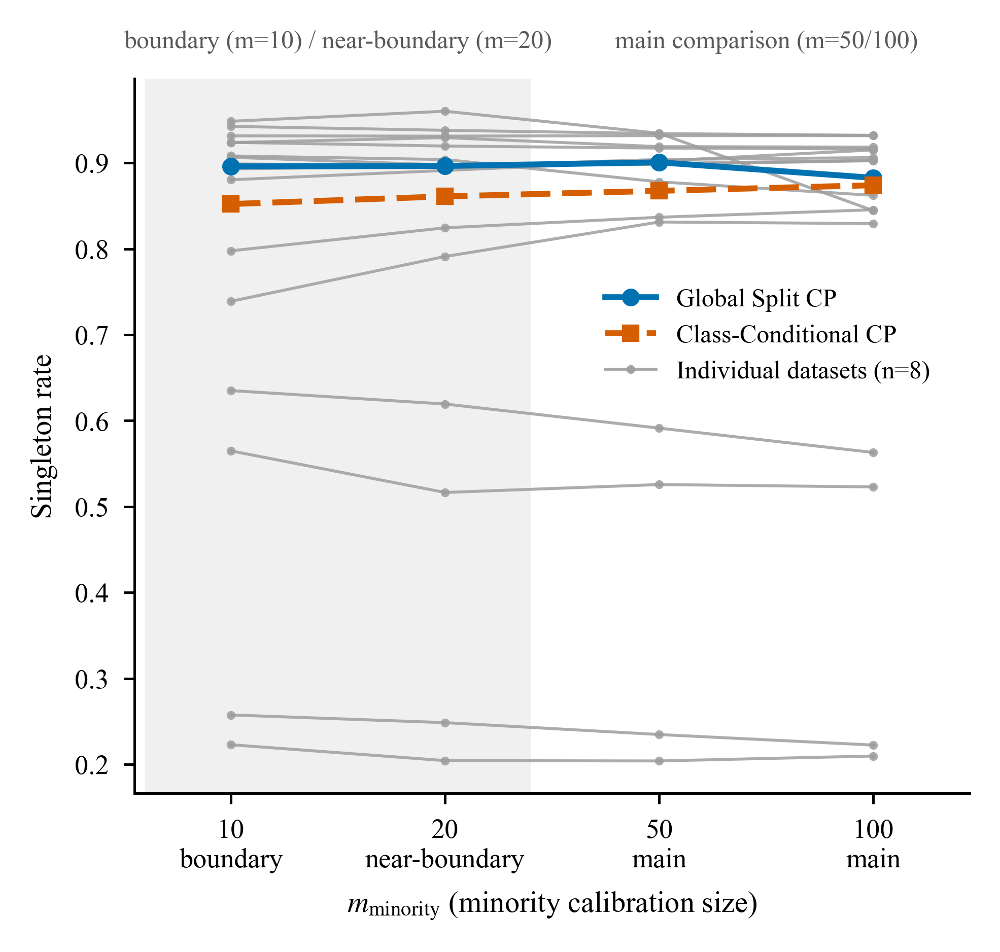
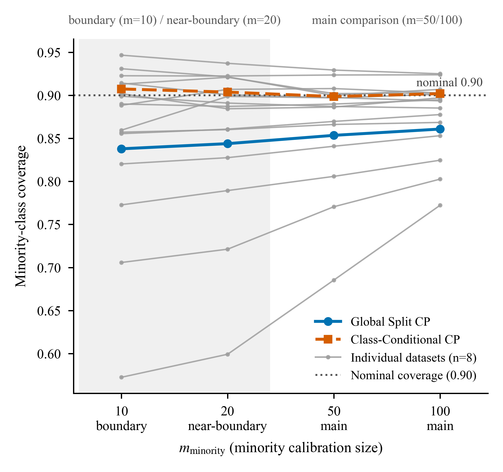
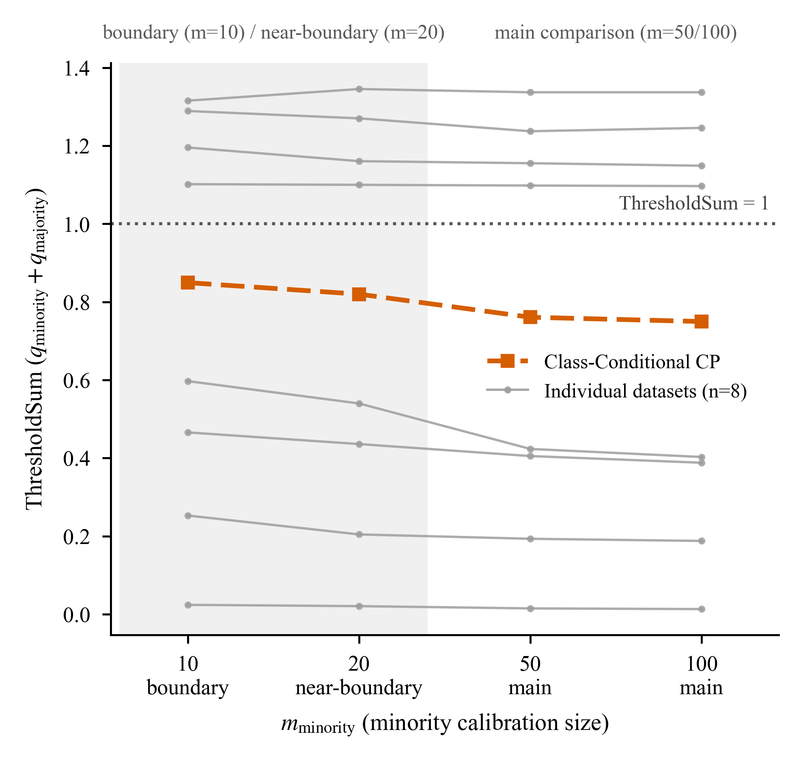
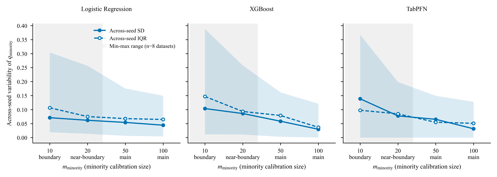

# Label-conditional conformal prediction improves class-wise coverage under calibration scarcity

**Guoxi Fan**

Nankai University, Tianjin 300071, China  
Correspondence: Guoxi.Fan@outlook.com

## Abstract

Marginally valid prediction sets can still under-cover a minority label when calibration data are uneven. We tested whether label-specific calibration corrects this imbalance across eight binary tabular datasets and three predictive pipelines. The design fixed 200 majority calibration observations and varied the minority contribution from 10 to 100, with matched same-`m` comparisons between a pooled-threshold baseline and Class-Conditional conformal prediction (CP). At `m=100`, Class-Conditional CP raised median minority coverage from 0.8607 to 0.9019; the paired median increase was 0.0411 (95% bootstrap CI, 0.0024 to 0.0909). Absolute class-wise disparity fell by 0.0285, while average set size increased by 0.0125. The same coverage-disparity pattern appeared at `m=50`. Doubling minority calibration from 50 to 100 within Class-Conditional CP left median singleton rate and average set size nearly unchanged, with mixed directions across datasets. Eight prespecified bootstrap intervals excluded zero, while auxiliary Holm-adjusted tests remained above 0.05. These results identify label conditioning as the main lever for class-wise coverage balance in this controlled scarcity regime, at a small cost in mean set size.

**Keywords:** label-conditional conformal prediction; class-wise coverage; calibration scarcity; imbalanced classification; prediction sets

## 1. Introduction

Conformal prediction (CP) converts predictive scores into sets with finite-sample coverage guarantees under exchangeability and a specified calibration construction [1,5]. Yet a marginal guarantee can conceal unequal coverage across labels. This matters when the less frequent label carries disproportionate scientific or operational importance. A common classification procedure uses held-out calibration data, the nonconformity score $s(x,y)=1-p_y(x)$, and a corrected finite-sample order statistic to determine which candidate labels enter the prediction set [1].

Label-conditional CP directly targets this problem by calibrating a separate threshold for each prespecified label [2,4]. Under within-label exchangeability, it aligns the calibration rule with class-wise coverage and exposes how pooled calibration can distribute errors unevenly across labels. Marginal, label-conditional, and arbitrary feature-conditional validity remain distinct targets [3].

Class-specific calibration also divides the available evidence by label. In many-class settings, small per-class samples can make classwise thresholds variable or conservative and enlarge prediction sets [4]. Binary tabular data provide a focused setting in which to separate minority calibration availability from the majority contribution. Prediction-set utility also depends on the nonconformity score and the underlying predictor [1], and tabular-model benchmarks show that discrimination and conformal uncertainty can diverge [6].

We establish a controlled binary-tabular benchmark that fixes the majority calibration contribution, reuses nested minority subsets, and compares pooled and label-specific thresholds on identical calibration observations. The central question is whether label conditioning improves minority coverage and class-wise balance at a manageable set-size cost. We then ask whether doubling the minority calibration sample from `m=50` to `m=100` changes efficiency, and where complete predictive pipelines alter these effects. Smaller samples (`m=10/20`) map the finite-sample boundary; the main comparisons use `m=50/100`.

## 2. Related work

### 2.1. Validity targets in conformal prediction

Marginal, label-conditional, and feature-conditional validity answer different questions. Standard split CP provides marginal coverage under exchangeability and a corrected calibration rule [1,5]. Label-conditional inductive CP instead targets coverage within a prespecified label group [2]. Exact distribution-free coverage at an arbitrary `X=x` generally requires further assumptions [3]. We focus on marginal and label-conditional targets.

### 2.2. Calibration scarcity and set efficiency

Class-Conditional CP allocates calibration evidence separately by label. In many-class image settings, direct classwise calibration can become noisy or overly conservative when each class has few calibration observations [4]. Prediction sets may then become large. This evidence motivates testing how calibration size relates to coverage and efficiency. Our binary-tabular design varied minority calibration size while fixing the majority contribution and reusing nested minority subsets.

### 2.3. Predictive pipelines, scores, and tabular uncertainty

The quality of a conformal set depends on the predictive model's score, even when the relevant assumptions preserve coverage validity [1]. AUROC and AUPRC measure discrimination rather than probability calibration, so they do not determine conformal set behavior. A recent benchmark found that strong tabular-model performance did not uniformly produce favorable conformal uncertainty behavior [6]. We therefore report AUROC/AUPRC as pipeline context and examine RQ3 at the level of complete predictive pipelines.

Together, this literature establishes the relevant validity targets and the tension between calibration scarcity and set efficiency. Our controlled binary-tabular regime combines fixed majority calibration, nested minority subsets, same-`m` paired calibration identifiers, and explicit binary `q0+q1` geometry to isolate how label conditioning redistributes coverage and set size.

## 3. Methods

### 3.1. Study design and datasets

We conducted a controlled resampling study using eight versioned public binary tabular datasets (Table 1): kr-vs-kp, mushroom, nomao, phoneme, adult, PhishingWebsites, higgs, and numerai28.6. The dataset registry records each source identifier, version, hash, label, and eligibility decision. All eight are available as versioned OpenML records [7]. Kr-vs-kp, mushroom, and adult originate from the UCI Machine Learning Repository [8]; Higgs, adult, and PhishingWebsites also have dedicated primary sources [9-11]. Dataset sizes ranged from 3,196 to 98,050 observations, with registry-defined minority ratios from 0.2393 to 0.4948.

**Table 1 | Dataset characteristics**

| Dataset | Domain | N | Features (raw) | Features (post-transform, max) | Minority label | Minority ratio | Train (maj/min) | Cal. pool (maj/min) | Test (maj/min) |
|-------------------------------------------------|--------------------|-----:|----------------:|-----------------------:|-----------|-----------:|-----------|--------------|-----------|
| kr-vs-kp (`openml_3_kr_vs_kp`) | chess endgame | 3,196 | 36 (0 num / 36 cat) | 73 | nowin | 0.4778 | 1001 / 916 | 334 / 305 | 334 / 306 |
| mushroom (`openml_24_mushroom`) | mushroom morphology | 8,124 | 22 (0 num / 22 cat) | 117 | p | 0.4820 | 2524 / 2350 | 842 / 783 | 842 / 783 |
| nomao (`openml_1486_nomao`) | entity matching | 34,465 | 118 (89 num / 29 cat) | 174 | 1 | 0.2856 | 14773 / 5906 | 4924 / 1969 | 4924 / 1969 |
| phoneme (`openml_1489_phoneme`) | speech | 5,404 | 5 (5 num / 0 cat) | 5 | 2 | 0.2935 | 2290 / 952 | 764 / 317 | 764 / 317 |
| adult (`openml_1590_adult`) | census income | 48,842 | 14 (6 num / 8 cat) | 108 | >50K | 0.2393 | 22292 / 7012 | 7432 / 2337 | 7431 / 2338 |
| PhishingWebsites (`openml_4534_phishingwebsite`) | web security | 11,055 | 30 (0 num / 30 cat) | 68 | -1 | 0.4431 | 3694 / 2939 | 1232 / 979 | 1231 / 980 |
| higgs (`openml_23512_higgs`) | particle-physics simulation | 98,050 | 28 (28 num / 0 cat) | 28 | 0 | 0.4714 | 31096 / 27734 | 10366 / 9244 | 10365 / 9245 |
| numerai28.6 (`openml_23517_numerai28_6`) | financial benchmark | 96,320 | 21 (21 num / 0 cat) | 21 | 0 | 0.4948 | 29195 / 28597 | 9731 / 9533 | 9732 / 9532 |

Class counts are means over the 10 prespecified seeds of the fixed splits; per-seed min/max values are in the CSV. Features (post-transform, max) is the registry maximum over seeds after train-only one-hot encoding. Minority ratio = minority class count / N in the raw dataset (registry-defined minority label).

We used the same ten fixed top-level seeds for every dataset: 104729, 130363, 155921, 196613, 262147, 318281, 374209, 419893, 481517, and 552721. Each seed produced a stratified split with 60% training, 20% calibration-pool, and 20% test data. We fitted all preprocessing steps to the training partition only. Numeric variables received median imputation, and Logistic Regression also used standardization. Categorical variables received most-frequent imputation and one-hot encoding, with unknown categories ignored. XGBoost used the same semantic transformed features without Logistic Regression's scaling step.

We derived each purpose-specific 32-bit seed from the first 32 bits of `SHA256(protocol_version + "|" + dataset_id + "|" + base_seed + "|" + purpose)`. The protocol version was v1.1. Registered purposes were `stratified_test_split`, `stratified_calibration_split`, `calibration_majority_subset`, `calibration_minority_nested_subset`, `logistic_regression`, `xgboost`, `tabpfn`, and `bootstrap`. The archived registry and manifests retain dataset identifiers, versions, label mappings, split hashes, and calibration-subset hashes.

### 3.2. Predictive pipelines

Three fixed predictive pipelines produced class probabilities: Logistic Regression, XGBoost, and TabPFN [12,13]. Logistic Regression used L2 regularization without class weighting. XGBoost used a binary logistic objective, 300 trees, depth 6, and no early stopping. TabPFN used version 8.5.0, the hash-pinned default TabPFN-3 classifier checkpoint, and complete fixed training partitions without truncation or subsampling. "Predictive pipeline" denotes the model, its model-appropriate preprocessing, and its fixed execution configuration. Exact hyperparameters, package versions, checkpoint identity, and hardware records are provided in `configs/stage05_lr_xgboost_v1.1.yaml`, `configs/stage05b_tabpfn_v1.1.yaml`, and `environment/hardware_software_record_v1.0.md`.

### 3.3. Calibration subsets and conformal construction

The target miscoverage was $\alpha=0.1$. Within every dataset-by-seed split, we fixed a majority calibration subset of 200 observations. We then drew nested minority subsets $S_{10}\subset S_{20}\subset S_{50}\subset S_{100}$. At each minority calibration size `m`, Global Split and Class-Conditional CP used identical calibration observation identifiers. The three predictive pipelines also used these identifiers.

The pooled calibration set contained 200 majority observations and `m` minority observations, while the test set retained the dataset's natural label mixture. We therefore treated Global Split CP as a fixed-composition, same-`m` pooled-threshold baseline. The standard marginal split-conformal guarantee does not transfer automatically to this baseline under the natural test-label mixture. Class-Conditional CP instead targets coverage within each label under within-label exchangeability. The Global/Class-Conditional comparison therefore estimates an empirical procedural contrast under matched calibration identifiers.

The only nonconformity score was $s(x,y)=1-p_y(x)$. For $n$ calibration scores, we used the rank

$$r=\left\lceil(n+1)(1-\alpha)\right\rceil$$

and threshold $q=S_{(r)}$. We included candidate label $y$ when $s(x,y)\leq q$. For `m={10,20,50,100}`, the Class-Conditional minority ranks were `{10,19,46,91}`, and the fixed majority rank was 181. The corresponding Global Split ranks were `{190,199,226,271}` for total calibration sizes `{210,220,250,300}`. At `m=10`, the minority threshold equals the maximum observed minority calibration score. We therefore used `m=10` only as a boundary diagnostic and `m=20` as a near-boundary diagnostic. Main comparisons used `m=50/100`. The nominal target of 0.90 differs from both the finite-sample rank level $r/(n+1)$ and empirical test coverage. Ties can make realized coverage conservative.

Global Split CP used one pooled threshold. Class-Conditional CP used separate thresholds $q_{\mathrm{minority}}$ and $q_{\mathrm{majority}}$. In the binary case, let $p$ denote the predicted probability of label 1. The procedure includes the two labels according to $p\geq1-q_1$ and $p\leq q_0$. A $\mathrm{ThresholdSum}=q_{\mathrm{minority}}+q_{\mathrm{majority}}<1$ permits an interval of empty prediction sets. A $\mathrm{ThresholdSum}>1$ permits an interval of doubleton sets. ThresholdSum describes the potential geometry of each unaggregated threshold pair; observed empty and doubleton rates also depend on the test probability distribution.

### 3.4. Outcomes

Base predictive outcomes were AUROC and AUPRC. Conformal outcomes included overall, minority, and majority coverage, as well as absolute class-wise coverage disparity. We also measured singleton rate, average set size, empty and doubleton rates, global or class-specific thresholds, ThresholdGap, and ThresholdSum. Threshold variability across seeds was summarized by the SD and IQR. We calculated Wilson intervals within each test-set cell and did not pool them across seeds or datasets.

### 3.5. Statistical analysis

The dataset was the unit of across-dataset inference (`n=8`). We first aggregated seeds within each dataset. For A/B, `d_j` was the arithmetic mean of all complete paired seed-level contrasts for dataset `j`. These contrasts covered three prespecified pipelines and ten seeds, with up to 30 pairs per dataset. For RQ3, each fixed pipeline pair used its ten paired seeds. A positive value means that the first named condition exceeded the second for the stated metric. The reported A/B effect was the median of the eight `d_j` values. Two-sided 95% percentile bootstrap intervals used 20,000 resamples of the eight whole-dataset effects. We also reported counts of positive, negative, and zero dataset effects. Protocol completeness rules governed the exclusion of missing or incomplete pairs.

Exact two-sided Wilcoxon signed-rank tests were auxiliary. We discarded and counted zeros. Holm adjustment controlled multiplicity within preregistered family A, which contained two RQ1 efficiency endpoints. Family B contained ten RQ2 endpoints. RQ3 contrasts were exploratory and are summarized by their effects, intervals, and directions.

Table 3 reports paired-effect estimates. Figures 1-3 and Table 4 summarize the underlying cells descriptively.

### 3.6. Quality control and analysis integrity

The analysis grid contained all 1,920 planned dataset-by-seed-by-pipeline-by-CP-by-`m` cells. Quality control covered cell uniqueness and completeness, exact ranks, split and calibration-subset identity, threshold and prediction-set identities, Wilson calculations, probability-cache provenance, and AUROC/AUPRC invariance within each base prediction unit.

## 4. Results

### 4.1. Predictive performance across pipelines

Predictive discrimination varied substantially across datasets and pipelines (Table 2). AUROC was approximately 0.52-0.53 on numerai28.6 and 1.00 on mushroom, and pipeline ordering changed across datasets. Each base-probability unit feeds every CP method and calibration size, so AUROC and AUPRC are constant within a dataset-by-seed-by-pipeline unit. This variation provides the predictive context for the conformal comparisons.

**Table 2 | Base predictive performance**

AUROC / AUPRC on the 20% test split; mean (SD) across the 10 frozen seeds per dataset x predictive pipeline.

| Dataset | AUROC: Logistic Regression | AUROC: XGBoost | AUROC: TabPFN | AUPRC: Logistic Regression | AUPRC: XGBoost | AUPRC: TabPFN |
|----------------|--------------------------:|--------------:|-------------:|--------------------------:|--------------:|-------------:|
| kr-vs-kp | 0.994 (0.002) | 0.999 (0.001) | 1.000 (0.000) | 0.993 (0.002) | 0.999 (0.001) | 1.000 (0.000) |
| mushroom | 1.000 (0.000) | 1.000 (0.000) | 1.000 (0.000) | 1.000 (0.000) | 1.000 (0.000) | 1.000 (0.000) |
| nomao | 0.988 (0.001) | 0.995 (0.001) | 0.996 (0.000) | 0.972 (0.002) | 0.989 (0.001) | 0.991 (0.001) |
| phoneme | 0.812 (0.009) | 0.951 (0.003) | 0.972 (0.003) | 0.587 (0.022) | 0.891 (0.008) | 0.938 (0.006) |
| adult | 0.904 (0.002) | 0.928 (0.002) | 0.916 (0.002) | 0.760 (0.007) | 0.828 (0.005) | 0.793 (0.005) |
| PhishingWebsites | 0.986 (0.001) | 0.995 (0.001) | 0.998 (0.001) | 0.984 (0.001) | 0.995 (0.001) | 0.997 (0.001) |
| higgs | 0.681 (0.004) | 0.805 (0.003) | 0.822 (0.003) | 0.661 (0.004) | 0.786 (0.004) | 0.806 (0.003) |
| numerai28.6 | 0.530 (0.002) | 0.519 (0.002) | 0.531 (0.003) | 0.521 (0.003) | 0.513 (0.002) | 0.524 (0.003) |

The same base probabilities feed every CP method and calibration size within a dataset-by-seed-by-pipeline unit.

### 4.2. Label conditioning brings minority coverage to the nominal target

At both main calibration sizes, Class-Conditional CP moved coverage toward class-wise balance. Relative to Global Split CP, it increased minority coverage, reduced majority coverage and absolute class-wise disparity, and modestly increased average set size. Singleton rate varied less consistently. Table 3 reports the paired effect sizes, bootstrap intervals, and direction counts.

The dataset summaries show the practical scale of this shift (Fig. 2 and Table 4). Median minority coverage under Class-Conditional CP was 0.8985 at `m=50` and 0.9019 at `m=100`, close to the nominal target of 0.90. The corresponding Global Split CP medians were 0.8534 and 0.8607. After seed aggregation, each dataset received equal weight.

**Table 3 | Paired Class-Conditional-minus-Global effects at the main calibration sizes**

Effects are medians of eight dataset-level paired effects. CIs are two-sided 95% percentile bootstrap intervals. Direction counts are positive / negative / zero dataset effects.

| m | Endpoint | Median effect | 95% bootstrap CI | Direction counts |
|---:|---|---:|---:|---:|
| 50 | Minority coverage | +0.047165 | +0.005705 to +0.126709 | 7 / 1 / 0 |
| 50 | Majority coverage | −0.011765 | −0.031457 to −0.000752 | 0 / 8 / 0 |
| 50 | Absolute class-wise disparity | −0.022957 | −0.118824 to −0.001032 | 1 / 7 / 0 |
| 50 | Average set size | +0.022908 | +0.002359 to +0.070151 | 7 / 1 / 0 |
| 50 | Singleton rate | −0.015840 | −0.065652 to +0.015031 | 3 / 5 / 0 |
| 100 | Minority coverage | +0.041143 | +0.002397 to +0.090852 | 8 / 0 / 0 |
| 100 | Majority coverage | −0.016877 | −0.043237 to −0.003194 | 0 / 8 / 0 |
| 100 | Absolute class-wise disparity | −0.028515 | −0.100144 to −0.001651 | 1 / 7 / 0 |
| 100 | Average set size | +0.012457 | +0.000369 to +0.022263 | 7 / 1 / 0 |
| 100 | Singleton rate | −0.006608 | −0.016713 to +0.001054 | 3 / 5 / 0 |

**Table 4 | Main CP results (m = 50/100)**

Median (q1-q3) across the 8 dataset-level means; each dataset-level value averages the 3 pipelines x 10 seeds (30 cells). The main comparison uses m=50 and m=100; m=10 and m=20 appear as boundary diagnostics in the figures. q_minority and ThresholdSum are Class-Conditional quantities because Global Split CP uses a pooled threshold.

| CP method | m | Minority coverage | Majority coverage | Singleton rate | Avg. set size | q_minority | ThresholdSum |
|--------------------|----------:|----------------------|----------------------|----------------------|----------------------|----------------------|----------------------|
| Class-Conditional CP | 50 (main) | 0.8985 (0.8945-0.9034) | 0.9044 (0.8990-0.9072) | 0.8675 (0.7548-0.9176) | 1.0416 (0.9185-1.2452) | 0.4363 (0.2446-0.7133) | 0.7608 (0.3521-1.1759) |
| Class-Conditional CP | 100 (main) | 0.9019 (0.8962-0.9036) | 0.9044 (0.8990-0.9072) | 0.8740 (0.7528-0.9167) | 1.0366 (0.9178-1.2472) | 0.4271 (0.2277-0.7117) | 0.7498 (0.3379-1.1733) |
| Global Split CP | 50 (main) | 0.8534 (0.7970-0.8747) | 0.9212 (0.9067-0.9357) | 0.9007 (0.8063-0.9109) | 0.9986 (0.9035-1.1614) | - | - |
| Global Split CP | 100 (main) | 0.8607 (0.8191-0.8819) | 0.9271 (0.9116-0.9409) | 0.8826 (0.7741-0.9084) | 1.0253 (0.9129-1.2259) | - | - |

Eight of the 12 prespecified bootstrap intervals excluded zero. Under the auxiliary Holm-adjusted Wilcoxon analysis, the smallest adjusted value in family B was 0.078125.

### 4.3. Efficiency remains stable as minority calibration doubles

Within Class-Conditional CP, increasing `m` from 50 to 100 left both preregistered efficiency endpoints close to zero at the dataset median (Fig. 1). Singleton rate changed by −0.000841 (95% bootstrap CI, −0.002072 to +0.005734), and average set size changed by −0.000841 (−0.005734 to +0.002771). For both endpoints, three dataset effects were positive and five were negative. Exact Wilcoxon tests gave raw `p=0.7422` and `p=0.6406`; both Holm-adjusted values were 1.0000. Over this range, additional minority calibration refined thresholds without a systematic change in set efficiency.

Majority coverage was identical at `m=50` and `m=100` for all eight dataset effects (median and interval, 0), reflecting the common 200-observation majority subset and majority threshold.

### 4.4. Threshold geometry and across-seed variability

ThresholdSum varied markedly across datasets (Fig. 3). At `m=50`, the cross-dataset median was 0.7608 and the interquartile range was 0.3521-1.1759. At `m=100`, the median was 0.7498 and the interquartile range was 0.3379-1.1733. Medians below 1 and upper quartiles above 1 indicate both potential-empty and potential-doubleton geometries across datasets. This geometry refers to each unaggregated threshold pair; observed set types also depend on the test probability distribution.

Across-dataset summaries of the empirical across-seed SD of `q_minority` generally decreased as `m` increased, although several dataset-by-pipeline cells differed (Fig. 4). From `m=50` to `m=100`, the SD increased for Nomao with Logistic Regression (0.1400 to 0.1496), Phoneme with Logistic Regression (0.0467 to 0.0486), and Numerai with XGBoost (0.0115 to 0.0141). Other non-monotone local patterns occurred across the full grid. The idealized Beta order-statistic variance was analyzed separately because it is defined on the probability scale [14].

### 4.5. Pipeline effects concentrate in selected settings

Seven of 90 exploratory fixed-`m`, fixed-CP predictive-pipeline contrasts had bootstrap intervals that excluded zero. Under Global Split CP, XGBoost produced smaller average sets than Logistic Regression at `m=50` (median −0.0212; CI, −0.1379 to −0.0011) and `m=100` (−0.0171; −0.1642 to −0.0030). TabPFN produced higher minority coverage than Logistic Regression under Global Split CP at `m=50` (+0.0138; +0.0065 to +0.0760) and smaller average sets under Class-Conditional CP at `m=100` (−0.0145; −0.2104 to −0.0017). Against XGBoost, TabPFN showed a small positive minority-coverage contrast under Class-Conditional CP at `m=100` (+0.0049; approximately +0.0000 to +0.0097). The complete 90-row table reports all exploratory contrasts.

The selected gains were endpoint- and procedure-specific rather than a single overall pipeline ranking. Each contrast represents the complete model, preprocessing, and execution configuration.

## 5. Discussion

Label conditioning was the decisive intervention in this controlled scarcity regime. At `m=100`, it moved median minority coverage from 0.8607 to 0.9019, reduced absolute class-wise disparity by 0.0285, and increased average set size by 0.0125. The same pattern appeared at `m=50`, and the coverage effects aligned across most datasets. Separate class thresholds therefore redistributed coverage toward the minority label while preserving compact prediction sets on average.

Doubling minority calibration from `m=50` to `m=100` produced near-zero median changes in singleton rate and average set size, with three positive and five negative dataset effects for each endpoint. Threshold variability often declined in aggregate but increased in several dataset-by-pipeline cells. Calibration count determines the order-statistic rank, whereas realized set efficiency also reflects the local distribution of predicted probabilities. The main efficiency gain in this design came from choosing the coverage target, not from increasing `m` within the tested range.

ThresholdSum connected the class-specific thresholds to binary set geometry: values below 1 permit an empty-set interval, whereas values above 1 permit a doubleton interval. The broad cross-dataset range spanned both regimes. Read alongside empty, doubleton, and singleton rates and average set size, this quantity reveals how a coverage allocation translates into usable prediction sets.

Predictive pipelines shaped selected endpoints and operating points. XGBoost produced smaller sets than Logistic Regression under the pooled baseline, while TabPFN improved minority coverage or set size in specific comparisons. These endpoint-specific gains reinforce the value of evaluating the complete predictor-calibrator pipeline rather than selecting a model from AUROC or AUPRC alone.

Together, the results show that label conditioning can recover minority coverage and narrow class-wise disparity with a small increase in average set size. Evaluations of class-wise reliability should therefore pair coverage by label with set efficiency and threshold geometry; marginal coverage and discrimination alone miss the central trade-off [6].

## 6. Limitations

The evidence is strongest for IID binary tabular data under controlled minority calibration scarcity: eight datasets, ten seeds, one probability-based nonconformity score, two CP procedures, and fixed predictive pipelines. Dataset-level summaries weight the eight datasets equally, and several intervals remain wide. The design covers moderate raw imbalance rather than extreme class rarity or distribution shift. Cross-`m` Global Split comparisons change both total calibration size and class composition, while the 90 pipeline contrasts remain exploratory. The idealized Beta variance assumes a continuous score CDF and provides a probability-scale reference rather than the scale of empirical threshold SD/IQR or singleton rate [14].

## 7. Reproducibility

The result table contains all 1,920 planned cells: 8 datasets × 10 seeds × 3 predictive pipelines × 2 CP procedures × 4 minority calibration sizes. It is stored in `results/results_long.parquet` with SHA-256 `d795d07c36a58619d715c18da6195d929124e43d42abafb45de2dc5134b3dcc2`. The archive also contains 240 base-probability units, 80 fixed split manifests, calibration-subset identities, model and dataset hashes, exact ranks, statistical endpoint tables, and figure and table source data. The dataset registry, protocol, fixed seeds, pipeline configurations, TabPFN runtime lock, and analysis manifest support full reconstruction of the reported results.

## 8. Figure legends

Unless stated otherwise, figures summarize 1,920 cells spanning 8 datasets, 10 seeds, 3 predictive pipelines, 2 CP methods, and `m={10,20,50,100}`, with `alpha=0.1` and `m_majority=200`. The dataset is the statistical unit (`n=8`); each dataset-level value averages 30 cells from 3 pipelines and 10 seeds. Bold curves show cross-dataset medians, thin grey curves show individual datasets, and paired effects and bootstrap intervals appear in the statistical tables.

{width=88%}

**Figure 1 |** Singleton rate at prespecified minority calibration sizes. Singleton rate is the fraction of test prediction sets that contain exactly one label. The figure compares Global Split CP (blue solid lines and circles) with Class-Conditional CP (vermillion dashed lines and squares). Bold curves are medians across eight datasets. Thin grey curves show individual datasets, each averaged across three predictive pipelines and ten seeds. Colour, line style, and markers redundantly encode the CP-method contrast for colour-blind and greyscale readability. Shading and tick annotations identify the boundary diagnostic (m = 10), near-boundary diagnostic (m = 20), and preregistered main-comparison range (m = 50/100). Source data: figure1_singleton_rate/figure1_singleton_rate_source_data.csv, figure1_singleton_rate_summary.csv, and figure1_singleton_rate_detail_by_model.csv.

{width=88%}

**Figure 2 |** Minority-class coverage at prespecified calibration sizes. The figure shows minority-class test coverage at four values of m. It compares Global Split CP (blue solid lines and circles) with Class-Conditional CP (vermillion dashed lines and squares). A dotted line marks the nominal 90% coverage target (alpha = 0.1); finite-sample ranks and ties can make empirical coverage conservative. Aggregation, redundant encoding, and boundary annotations follow Fig. 1. In the main-comparison range, Class-Conditional CP moved minority coverage toward the nominal target relative to Global Split CP. Source data: figure2_minority_coverage/figure2_minority_coverage_source_data.csv, figure2_minority_coverage_summary.csv, and figure2_minority_coverage_detail_by_model.csv.

{width=88%}

**Figure 3 |** ThresholdSum geometry at prespecified calibration sizes. ThresholdSum equals q_minority + q_majority on the nonconformity-score scale. The figure shows Class-Conditional CP, which uses class-specific thresholds, at four values of m. A dotted line marks ThresholdSum = 1. Values below 1 permit potential empty prediction sets, while values above 1 permit potential doubleton sets for each unaggregated threshold pair. Aggregation and boundary annotations follow Fig. 1. Source data: figure3_threshold_sum/figure3_threshold_sum_source_data.csv, figure3_threshold_sum_summary.csv, and figure3_threshold_sum_detail_by_model.csv.

{width=88%}

**Figure 4 |** Across-seed variability of the minority threshold (auxiliary). The figure shows empirical variability in the Class-Conditional minority threshold q_minority on the score scale. Solid lines and filled circles show the SD, shaded bands show the minimum-maximum range across eight datasets, and dash-dot lines with open circles show the IQR. Panels separate predictive pipelines, and each dataset-level value uses ten seeds. The shaded band is a descriptive envelope rather than a confidence interval. Boundary and main-comparison shading follow Fig. 1. Source data: figure4_threshold_variability/figure4_source_data.csv and figure4_summary.csv.

## 9. Declarations

**Data availability.** All eight datasets are publicly available as versioned OpenML records [7], with data IDs 3, 24, 1486, 1489, 1590, 4534, 23512, and 23517. Kr-vs-kp, mushroom, and adult originate from the UCI Machine Learning Repository [8]. The release archive will include the versioned dataset registry, split manifests, calibration-subset identities, result table, statistical endpoint tables, and supporting manifests (Code availability).

**Code availability.** The complete analysis code, fixed configuration files, pipeline entry points, and provenance records are prepared for release. [Insert the verified public repository URL and versioned Zenodo DOI before submission.]

**Author contributions.** Guoxi Fan: Conceptualization, Methodology, Validation, Formal analysis, Investigation, Data curation, Visualization, Writing - original draft, Writing - review and editing, Supervision, and Project administration.

**Funding.** [To be supplied by the author.]

**Competing interests.** [Insert the author-approved journal declaration before submission.]

**AI use disclosure.** AI tools assisted coding, analysis checks, and language editing under author supervision. Guoxi Fan retains responsibility for the study design, results, interpretation, and manuscript. This statement will be adapted to the target venue's policy at submission.

**Acknowledgements.** [To be supplied by the author; may be omitted.]

## 10. References

1. Angelopoulos, A. N. & Bates, S. Conformal prediction: a gentle introduction. *Foundations and Trends in Machine Learning* **16**(4), 494-591 (2023). https://doi.org/10.1561/2200000101.
2. Vovk, V. Conditional validity of inductive conformal predictors. *Proceedings of Machine Learning Research* **25**, 475-490 (2012).
3. Barber, R. F., Candès, E. J., Ramdas, A. & Tibshirani, R. J. The limits of distribution-free conditional predictive inference. *Information and Inference* **10**(2), 455-482 (2021). https://doi.org/10.1093/imaiai/iaaa017.
4. Ding, T., Angelopoulos, A. N., Bates, S., Jordan, M. I. & Tibshirani, R. J. Class-conditional conformal prediction with many classes. *Advances in Neural Information Processing Systems* **36** (2023). https://doi.org/10.52202/075280-2817.
5. Zhou, X., Chen, B., Gui, Y. & Cheng, L. Conformal prediction: a data perspective. *ACM Computing Surveys* **58**(2), Article 49 (2025). https://doi.org/10.1145/3736575.
6. De Melo Costa, J. L., Popineau, F., Rimmel, A. & Doan, B.-L. High performance, low reliability: uncertainty benchmarking for tabular foundation models. In *ESANN 2026 Proceedings*, 115-120 (2026). ISBN 9782875870964. https://doi.org/10.14428/esann/2026.ES2026-261.
7. Vanschoren, J., van Rijn, J. N., Bischl, B. & Torgo, L. OpenML: networked science in machine learning. *ACM SIGKDD Explorations Newsletter* **15**(2), 49-60 (2014). https://doi.org/10.1145/2641190.2641198.
8. Kelly, M., Longjohn, R. & Nottingham, K. *The UCI Machine Learning Repository*. Available at https://archive.ics.uci.edu (accessed 31 August 2026).
9. Baldi, P., Sadowski, P. & Whiteson, D. Searching for exotic particles in high-energy physics with deep learning. *Nature Communications* **5**, 4308 (2014). https://doi.org/10.1038/ncomms5308.
10. Kohavi, R. Scaling up the accuracy of Naive-Bayes classifiers: a decision-tree hybrid. In *KDD'96: Proceedings of the Second International Conference on Knowledge Discovery and Data Mining* (eds Simoudis, E., Han, J. & Fayyad, U.) 202-207 (AAAI Press, 1996).
11. Mohammad, R. M. A., Thabtah, F. & McCluskey, L. An assessment of features related to phishing websites using an automated technique. In *Proceedings of the 7th International Conference for Internet Technology and Secured Transactions (ICITST 2012)* 492-497 (IEEE, 2012).
12. Chen, T. & Guestrin, C. XGBoost: a scalable tree boosting system. In *Proceedings of the 22nd ACM SIGKDD International Conference on Knowledge Discovery and Data Mining* 785-794 (ACM, 2016). https://doi.org/10.1145/2939672.2939785.
13. Prior Labs Team. TabPFN-3: technical report. *arXiv* 2605.13986 (2026). https://arxiv.org/abs/2605.13986.
14. David, H. A. & Nagaraja, H. N. *Order Statistics* 3rd edn (Wiley, 2003).
